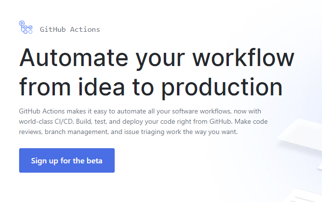
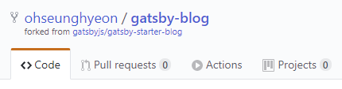
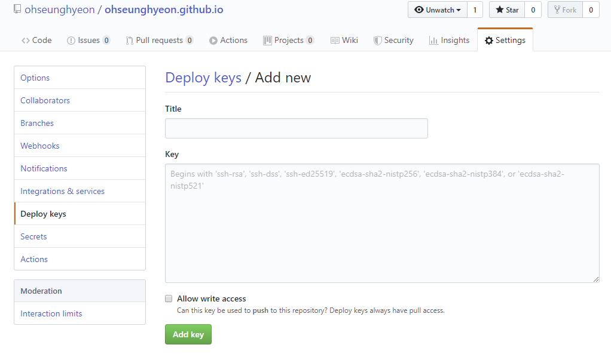
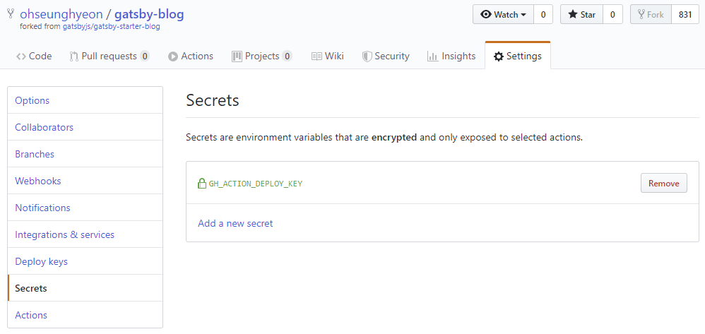

나는 Github pages를 운영하기 위해서 다음과 같이 두 개의 저장소를 사용하고 있다.

```
- username.github.io 저장소 (static files)
- 블로그 생성기 저장소 (gatsby - static site generater)
```

수동으로 블로그를 배포하기 위해서 블로그의 정적 파일들을 생성하고, 이를 **username.github.io** 저장소에 푸쉬해 왔다.  
이 과정을 어떻게 자동화 할 수 있을까 생각하다가 다음 몇 가지를 찾았다.

1. [Netlify](https://www.netlify.com/)
2. [NOW](https://zeit.co/dashboard)
3. Github Actions

요즘 블로깅하시는 개발자 분들을 보면 Netlify라는 서비스를 많이 사용하고 있다. 단순한 호스팅 외에 많은 기능을 제공하는 서비스로 보인다.

이 서비스를 사용하면 **username.github.io** 같은 저장소를 사용하여 필요가 없다. 블로그의 호스팅을 github pages가 아닌 netlify로 할 수 있기 때문이다. 그래서 블로그 생성기 저장소에 push하고 netlify 서비스만 연동하면 알아서 정적 파일들을 생성하여 호스팅까지 해줄 수 있다.

그러므로, 이 글을 보고 이해가 안 되거나, "나는 귀찮은 게 싫어" 라는 분이 계시면 netlify 또는 NOW를 사용하시면 되겠다.

### Github Actions



Github Actions는 2018년에 발표됐고, 현재는 beta 버전이다. 사용하기 위해서는 따로 [등록](https://github.com/features/actions)이 필요하며, 2019년 11월 13일부터 공개 버전으로 기본적인 기능으로 사용할 수 있다.

`youtube:https://www.youtube.com/embed/E1OunoCyuhY`

Github Actions는 깃헙 저장소의 push, pull request 등 미리 정의된 이벤트에 의해 사용자가 원하는 행동을 취할 수 있다. 이미 존재하는 다른 CI/CD 도구들처럼 빌드, 테스트, 배포 등을 할 수 있다.

또한 누군가 이슈를 올렸을 때 특정한 로직을 실행(이슈에 올라온 코드를 자동으로 실행하여 에러를 발견하는 등)할 수도 있고, pull request에 대해 PR 된 버전과 기존의 master 버전을 각각 배포한 url을 PR 쓰레드의 댓글로 달게 할 수도 있다.

## 어떻게 배포할까

앞서 말했듯이 내 경우는 **정적 사이트 생성기**와 **github pages** 저장소가 따로 존재한다. (한 저장소에 다른 브랜치로 두면 과정이 더 편했을 것을)

Gatsby 공식 사이트의 문서에 [Github Pages 관련 배포에 대한 문서](https://www.gatsbyjs.org/docs/how-gatsby-works-with-github-pages/)가 있으나 이는 한 저장소 내에 정적 사이트 생성기와 정적 파일이 *브랜치*로 구분되어 있는 경우를 설명하는 것이기에 나의 경우와는 관련이 없다.

내 경우 배포 자동화의 과정은 다음과 같다.

1. 정적 사이트 생성기 저장소에서 push를 한다.
2. push된 정적 사이트 생성기 저장소에서 gatsby build 명령어로 정적 파일들을 생성한다. (`/public` 경로에 파일 생성됨)
3. 생성된 파일을 **username.github.io** 저장소에 붙여 넣는다.
4. **username.github.io** 저장소를 커밋해 푸쉬한다.

분명 간단한 과정이긴 한데, Github Actions에서 구현하려면 어떻게 하지?

## Github actions 톺아보기



위와 같이 깃허브 저장소에 가면 Actions 버튼이 있다.  
(Github Actions Beta를 신청하여 승인 이메일을 받은 경우에만 활성화된다.)

Actions 버튼을 누르면 Workflow 파일을 생성할 수 있는 페이지가 나온다. 해당 페이지에서 **Add a new workflow** 버튼을 눌러서 workflow 파일을 GUI 상에서 생성해도 되고, 직접 파일을 만들어도 된다. 나의 경우 직접 만들어서 진행하겠다.

### Workflow 생성하기

Workflow 파일은 저장소의 root에서 **.github/workflows** 디렉토리를 생성한 후 그 내부에 `.yml` 또는 `.yaml`로 생성한다. 내 경우 blog deploy를 위해 다음과 같이 만들겠다. yml 파일의 이름은 아무렇게나 해도 되는 것 같다.

```
/.github/workflows/continuous-deployment-workflow.yml
```

참고로 Github Actions가 나온 당시에는 HCL syntax라는 것을 사용했지만 2019년 9월 30일 이후로 deprecated 된다. 조금 오래된 자료를 찾아보면 yml이 아닌 특이한 syntax를 가진 workflow 또는 action 파일을 찾을 수 있는데 이는 모두 곧 쓸모 없어진다.

workflow 작성법을 알고 싶다면 [Configuring a workflow](https://help.github.com/en/articles/configuring-a-workflow)와 [Workflow syntax for Github Actions](https://help.github.com/en/articles/workflow-syntax-for-github-actions)를 참고하길 바란다.

yml에 대해 빠르게 알고 싶다면 [Learn YAML in five minutes!](https://www.codeproject.com/Articles/1214409/Learn-YAML-in-five-minutes)을 참고하라.

아래는 배포를 위해 만든 workflow 파일이다

```yml
name: Blog Deployment

on: [push]

jobs:
  build:
    name: build
    runs-on: ubuntu-latest
    steps:
    - name: clone gatsby-blog
      uses: actions/checkout@master
      with:
        path: 'static-site-generator'

    - name: git config
      env:
        USER_NAME: ${{ github.event.pusher.name }}
        USER_EMAIL: ${{ github.event.pusher.email }}
      run: |
        git config --global user.email "$USER_EMAIL"
        git config --global user.name "$USER_NAME"

    - name: make deploy keys
      env:
        GH_ACTION_DEPLOY_KEY: ${{ secrets.GH_ACTION_DEPLOY_KEY }}
      run: |
        mkdir -p ~/.ssh/
        echo "$GH_ACTION_DEPLOY_KEY" > ~/.ssh/id_rsa
        chmod 600 ~/.ssh/id_rsa
        ssh-keyscan github.com >> ~/.ssh/known_hosts

    - name: clone static_site_repo
      run: |
        cd ..
        git clone git@github.com:ohseunghyeon/ohseunghyeon.github.io.git static_site_repo


    - name: install dependencies & build
      run: |
        yarn
        yarn build

    - name: move build files to static files repo
      run: |
        rm -rf ../static_site_repo/*
        mv ./public/* ../static_site_repo

    - name: push changed files
      run: |
        cd ../static_site_repo
        git add .
        git commit -m "$(git -C ../static-site-generator/ log --format=%B -n 1)"
        git push origin master
```

### name, on, jobs

```yml
name: Blog Deployment

on: [push]

jobs: ...
```

- `name`: Workflow의 이름
- `on`: 여기에 기술된 이벤트에 의해 이 workflow가 작동한다. 특정 동작일 수도 있고, schedule이 될 수도 있다. 나의 경우 해당 브랜치에서 push가 발생할 때 이 workflow를 실행한다. 특정 브랜치, 특정 파일에 의한 trigger도 지정 가능하다. 자세한 내용은 [Event Trigger](https://help.github.com/en/articles/events-that-trigger-workflows)를 참고하라.
- `jobs`: job이란 workflow에서 실행할 작업의 단위이다.

### job

```yml
jobs:
  build:
    name: build
    runs-on: ubuntu-latest
    steps:
      ...
```

`jobs` 아래에 위치한 **build**는 job이다. 해당 job 엔 name, runs-on, steps가 있다.

- `name`: job의 이름. 생략 가능하다.
- `runs-on`: 해당 job을 실행할 가상 환경으로 ubuntu, linux, macOs 로 설정할 수 있다.
- `steps`: step은 Job이 실행되는 하나의 가상 환경에서 이루어질 일련의 작업이다. job이 추상적인 단위라면 step은 좀 더 실질적인 단위로, command나 action을 실행할 수 있다.

### step - name, run

```yml
steps:
- name: install dependencies & build
  run: |
    yarn
    yarn build
```

`name`과 `run`이 있다. name은 생략 가능하며 이 때 name은 알아서 정해진다. 그리고 run은 command를 실행한다. command는 다음과 같이 한 줄 또는 여러줄로 생성 가능하다.

```yml
# single line
steps:
- run: yarn

# multiple lines
- run: |
  yarn
  yarn build
  ...
```

### step - env

```yml
steps:
- name: git config
  env:
    USER_NAME: ${{ github.event.pusher.name }}
    USER_EMAIL: ${{ github.event.pusher.email }}
  run: |
    git config --global user.email "$USER_EMAIL"
    git config --global user.name "$USER_NAME"
```

`env`에는 다음과 같이 아무 값이나 넣어서 설정할 수 있다.

```yml
env:
  USER_NAME: 게으른 고영이
```

그런데 `${{ github.event.pusher.name }}`는 뭘까? 이건 context와 이를 사용하는 문법이다. 이 경우에는 github이라는 context 객체 아래에 있는 event.pusher.name를 환경변수 **USER_NAME**과 **USER_EMAIL**로 각각 설정하는 것이다.  

다음과 같이 step을 작성하면 github context에 어떤 값이 있는지 확인할 수 있다.

```yml
- name: Dump GitHub context
  env:
    GITHUB_CONTEXT: ${{ toJson(github) }}
  run: echo "$GITHUB_CONTEXT"
```

Context와 이를 사용하는 문법에 대한 문서는 [Contexts and expression syntax for GitHub Actions](https://help.github.com/en/articles/contexts-and-expression-syntax-for-github-actions)를 참조하라.

### step - uses

```yml
- name: clone gatsby-blog
  uses: actions/checkout@master
  with:
    path: 'static-site-generator'
```

- `uses`: Action을 사용한다는 뜻이다. 위에서 서술했듯 step은 command 또는 action을 사용할 수 있다. 위에 있는 action의 경우 [actions/checkout](https://github.com/actions/checkout) 저장소에 있다. 이렇게 action을 다른 저장소에서 가져와 사용하거나, workflow 파일이 존재하는 동일한 저장소에 만들어서 사용할 수도 있다.

  - `actions/checkout`: 이 액션은 workflow를 실행하는 저장소의 최신 내역을 받아온다. 찾아보면 이미 만들어진 다양한 action이 있다. node를 설치해주는 액션도 있고, python 설치하는 애도 있다. 조립하듯 필요한 걸 찾아서 써도 되고, 아니면 만들어도 되겠다.

- `with`: Action에게 넘겨주는 파라미터. path라는 파라미터에 'static-site-generator' 값을 넘겨주고 있다. actions/checkout 액션이 받을 수 있는 파라미터 값은 [여기](https://github.com/actions/checkout/blob/master/action.yml)에서 볼 수 있다. path는 'Optional path to check out source code' 이라고 되어 있는데, 내 경우 static-site-generator라는 디렉토리에 해당 저장소를 받겠다는 뜻이고, 설정하지 않을 경우 저장소 이름으로 디렉토리를 만들게 된다.

### Steps 설명

```yml
steps:
# 정적 생성기 저장소를 fetch한다.
- name: clone gatsby-blog
  uses: actions/checkout@master
  with:
    path: 'static-site-generator'

# git config로 이메일과 이름을 설정한다. 그 값들은 github context에서 가져온다.
- name: git config
  env:
    USER_NAME: ${{ github.event.pusher.name }}
    USER_EMAIL: ${{ github.event.pusher.email }}
  run: |
    git config --global user.email "$USER_EMAIL"
    git config --global user.name "$USER_NAME"

# ssh private 키를 job 가상환경에 설치한다.
# 정적 사이트 저장소 git을 clone하고 push하기 위해 필요하다
# 참고: https://cupfullofcode.com/blog/2018/12/21/deploying-hugo-with-github-actions/
- name: install deploy keys
  env:
    GH_ACTION_DEPLOY_KEY: ${{ secrets.GH_ACTION_DEPLOY_KEY }}
  run: |
    mkdir -p ~/.ssh/
    echo "$GH_ACTION_DEPLOY_KEY" > ~/.ssh/id_rsa
    chmod 600 ~/.ssh/id_rsa
    ssh-keyscan github.com >> ~/.ssh/known_hosts

# 정적 사이트를 static_stie_repo라는 directory에 clone한다.
- name: clone static_site_repo
  run: |
    cd ..
    git clone git@github.com:ohseunghyeon/ohseunghyeon.github.io.git static_site_repo

# static-site-generator 디렉토리에서 yarn과 yarn build를 실행한다.
# 바로 위의 step에서 cd ..로 workding directory를 바꿨는데
# 각각의 step은 working directory가 초기화되어
# 이 step에서 pwd는 static-site-generator directory이다.
- name: install dependencies & build
  run: |
    yarn
    yarn build

# 빌드한 파일들을 정적 사이트 저장소 디렉토리로 옮긴다.
- name: move build files to static files repo
  run: |
    rm -rf ../static_site_repo/*
    mv ./public/* ../static_site_repo

# 정적 사이트 저장소를 커밋하고 푸쉬한다.
# 커밋 내용은 정적 사이트 생성기의 제일 최근 커밋 메시지
- name: push changed files
  run: |
    cd ../static_site_repo
    git add .
    git commit -m "$(git -C ../static-site-generator/ log --format=%B -n 1)"
    git push origin master
```

나는 git 인증을 위해서 ssh key를 설치하는 방법을 택했다. 그러나 이 key는 깃 계정 세팅에서 넣는 키가  아닌 [deploy keys](https://developer.github.com/v3/guides/managing-deploy-keys/#deploy-keys)다. deploy keys를 설정하면 특정 프로젝트에 public key를 추가하여 접근 권한을 설정할 수 있다.

ssh key를 생성하는 법을 모른다면 [여기](https://help.github.com/en/articles/generating-a-new-ssh-key-and-adding-it-to-the-ssh-agent#generating-a-new-ssh-key)를 참고하거나, 다음 명령어를 치면 된다.

```shell
ssh-keygen -t rsa -b 4096 -C "your_email@example.com" -f ./ssh-key-name
```

Key가 준비되었다면 다음과 같이 저장소에 접근하기 위해 Deploy keys에 생성한 public key를 입력하고, 이 때 **Allow write access**를 꼭 체크해야 한다.



그리고 private key를 받아오는 과정이 필요한데, **install deploy keys**라는 이름을 가진 step에 `${{ secrets.GH_ACTION_DEPLOY_KEY }}` 라는 context가 보인다.

secrets는 저장소의 settings에서 설정 가능한데, private key를 secret에 추가하여 리눅스 가상환경에 가져가 파일로 생성하는 것이다.



이렇게 키까지 모두 세팅하면 저장소를 push할 때마다 자동으로 배포가 실행된다.

### Github Actions 용어 정리

아래 용어들은 [About GitHub Actions](https://help.github.com/en/articles/about-github-actions#workflow)의 번역본입니다.

<details>
<summary>여기를 눌러서 보기</summary>

#### Workflow

설정 가능한 자동화된 프로세스. 깃허브에 있는 프로젝트를 빌드, 테스트, 패키지, 릴리즈, 배포를 하기 위해서 저장소 내에 셋업할 수 있다. Workflow는 하나 이상의 job들로 이루어져 있으며, 스케쥴 또는 이벤트에 의해 활성화될 수 있다.

#### Workflow run

workflow의 인스턴스. 미리 설정된 이벤트가 발생했을 때 돌아간다. 매 workflow run에 대해 jobs, actions, logs, statuses를 확인할 수 있다.

#### Workflow file

YAML 파일. 하나 이상의 job을 포함한 workflow 설정 사항을 정의한다. 이 파일은 당신의 깃허브 저장소 최상단에서 `.github/workflows` 디렉토리 내에 존재한다.

#### Job

단계들로 정의된 하나의 작업. 매 작업은 새로 생성되는 가상 환경 인스턴스 내에서 동작한다. workflow file 내에서 job 들이 어떻게 돌아가야 하는지 설정하기 위해 의존성 규칙을 정의할 수 있다. job들을 나란히 돌릴 수도 있고, 이전 job의 상태를 봐가며 순차적으로 돌릴 수도 있다. 예를 들어 하나의 workflow에 **build**와 **test code**라는 두 개의 job이 있고, test job이 build job에 의존한다고 정의할 때, build job이 실패하면 test job은 돌아가지 않는다.

#### Step

step은 job에 의해 실행되는 task들의 집합이다. 각 스탭은 job이 실행되는 하나의 가상환경 안에서 action들이 filesystem을 사용하여 서로 정보를 교환할 수 있게 한다. step들은 command나 action을 실행할 수 있다.

#### Action

각각의 task들. 이를 결합하여 steps를 만들고 이는 곧 하나의 job이 된다. Action은 workflow에서 가장 작은 조립 블록이다. 당신의 actions를 만들 수 있고, 이 action을 깃허브 커뮤니티에 공유하거나, 다른 public action를 커스터마이즈 할 수도 있다. action을 workflow 내에서 사용하기 위해서는 반드시 action을 하나의 step으로써 포함해야 한다. (action === step 인가?)

#### Continuous integration (CI)

공유되는 저장소에 작은 코드를 빈번히 커밋할 때 사용되는 software 개발 방법. Github Actions를 가지고 빌드와 테스트를 자동화하기 위하여 당신만의 CI workflow를 생성할 수 있다. 저장소에서 workflow의 매 action 의 코드의 변화와 상세한 로그를 확인할 수 있다. CI는 버그를 더 빠르게 찾거나 해결하기 위해, 코드 상의 변화에 대한 즉각적인 반응을 제공하여 개발자의 시간을 절약해준다.

#### Continuous deployment (CD)

CI 상에서 빌드하는 것. 새로운 코드가 커밋되어 CI 테스트를 통과할 때, 그 코드는 자동으로 production에 배포된다. Github Actions를 가지고 당신만의 CD workflow를 만들 수 있으며, 이를 통해 자동으로 당신의 코드를 클라우드나, self-hosted service나 플랫폼에 배포할 수 있다. CD는 개발 과정을 자동화하고 테스트되고 안정된 코드 변화를 더 빠르게 고객에게 배포하여 개발자의 시간을 절약해준다.

#### Virtual environment

Github은 Linux, maxOS, Windows 가상 환경을 제공하여, 당신의 workflow를 돌리게 한다.

#### Runner

각 가상 환경 내의 Github 서비스는 가능한 job을 기다린다. runner가 job을 고르면, job의 actions를 실행하고, 경과, 로그, 결과를 깃헙에게 보고한다. runners는 한 번에 하나의 job을 실행한다.

#### Event

workflow run을 유발하는 특정 동작. 예를 들어 누군가 저장소에 커밋을 푸쉬하거나 이슈 또는 풀리퀘스트가 생성되는 행위.  또한 repository dispatch webhook을 사용한 외부 이벤트 발생을 이벤트로 설정할 수 있다.

#### Artifact

빌드나 코드를 테스트할 때 생성되는 파일. 예를 들어, 바이너리나 패키지 파일, 테스트 결과, 스크린샷, 로그 파일 등이 이에 해당한다. workflow에서 생성된 artifact는 해당 workflow와 관련이 있고, 다른 job에 의해 사용되거나 배포될 수 있다.

</details>

## 후기

workflow를 만들면서 job을 두 개로 나눠서 build, deploy로 할 수 있을까 생각했다. 그런데 그 둘은 독립된 가상 환경을 갖게 될 텐데 그럼 파일을 어디서 가져오지? 라는 생각이 들었다. 개념적으로 나누고 싶긴 한데, 그럴 방법이 있을지 계속 공부하며 찾아봐야겠다. 그리고 액션이나 docker를 사용하는 것에 대해서도 조금씩 알아가야겠다.

정적 사이트 저장소를 clone하고 push하는 과정이 조금 힘들었다. 처음에는 해당 저장소를 actions/checkout을 사용해서 가져왔다. 저 액션을 사용하면 https 프로토콜로 저장소를 가져오게 되는데 그러면 아이디와 비밀번호로 인증하여 push를 할 수 있다. 어떻게 할 수 있을지 한참 찾다가 personal access token이라는 걸 알게 됐는데.. 잘 안 됐다.

내 추측에 이 워크플로우가 동작할 때 어떤 토큰이 자동으로 생기는 것 같다. 그래서 그 토큰을 사용해보려고 했는데 안 됐다. 그렇다고 다른 토큰을 직접 생성해서 해봐도 잘 안 됐다. 명령어의 잘못이든, 내가 찾아내지 못했든.. 혹시 어딘가 다른 방법이 있다면 알고 싶다.

## 참고 자료

- [Outsider - GitHub Actions 소개](https://blog.outsider.ne.kr/1412)
- [css tricks - Introducing GitHub Actions](https://css-tricks.com/introducing-github-actions/)
- [허원철의 개발 블로그 - GitHub Action을 활용한 GitHub Page 배포](https://heowc.dev/2019/02/03/deploy-gh-page-with-github-action/)
- [GitHub Actions v2: JS Actions](https://lannonbr.com/blog/2019-08-17-gh-actions-js-actions/)
