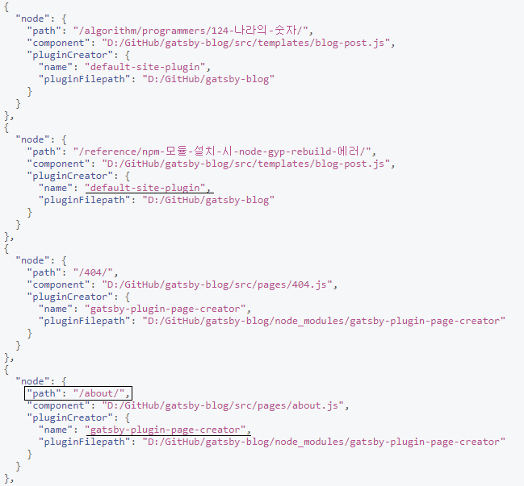

Docs에 따르면, Gatsby에서 페이지를 만드는 방법은 3가지가 있다.

1. In your site’s gatsby-node.js by implementing the API createPages
2. Gatsby core automatically turns React components in src/pages into pages
3. Plugins can also implement createPages and create pages for you

2번을 보면 Gatsby core는 자동으로 src/pages 폴더 내의 파일을 참조하여 해당 파일 이름의 path로 페이지를 생성한다는 내용이 있다.  
즉, `src/pages/about.js` 파일을 생성하면 `/about`이라는 경로로 페이지가 생성되고 `src/pages/abcd.js` 파일을 생성하면 `abcd`라는 경로로 페이지가 생성된다.

따라서 About 페이지를 만들기 위해서 할 일은 `src/pages/about.js` 파일을 생성하고 다음과 같이 소스를 작성하는 것이다. 그럼 자동으로 `/about` 경로로 페이지가 생성된다.

```javascript
import React from 'react';

import Layout from "../components/layout"
import SEO from "../components/seo"

const AboutPage = ({ location, data }) => (
  <Layout location={location} title={data.site.siteMetadata.title}>
    <SEO title="About" />
    <h1>About Me</h1>
    <p>안녕하세요 제 블로그에 오신 것을 환영합니다.</p>
  </Layout>
)

export default AboutPage

export const pageQuery = graphql`
  query {
    site {
      siteMetadata {
        title
      }
    }
  }
`
```

`src/pages/404.js`와 `src/pages/index.js` 페이지를 참고하여 작성했다.

페이지의 Wrapper인 Layout 컴포넌트를 최상위에 두고 아래에 SEO 컴포넌트와 제목, 내용 등을 배치했다. 또한 `404.js`에 있던 pageQuery를 그대로 들고와서 Layout 컴포넌트가 필요로 하는 데이터를 가져올 수 있게 만들었다.

(이 GraphQL Query는 pageQuery라는 변수로 export 되어야 하며, 작성된 컴포넌트의 props로 받게 되는 것 같다)

## 개발 중 GraphiQL로 생성된 페이지 목록을 확인하기

개발 서버를 실행하여 [GraphiQL](`localhost:8000/__graphql`)에 접근한 후 다음의 query를 실행하면 생성되는 페이지들의 path와 plugin 정보를 얻게 된다.

```graphql
{
  allSitePage {
    edges {
      node {
        path
        component
        pluginCreator {
          name
          pluginFilepath
        }
      }
    }
  }
}
```



/about/ 이라는 path로 페이지가 생성된 것이 보인다. 그런데 `404`, `about` 페이지와 위의 두 페이지는 pluginCreator 값이 다르다.

두 개의 다른 플러그인이 페이지를 생성하고 있는 걸로 보인다. 결국 기존에 있지 않은 페이지를 생성한다는 건 어떤 플러그인을 수정하거나 새로운 플러그인을 만들어야 한다는 뜻일까?
