## 발단

난 블로그를 이쁘게 만들고 싶다. 그래서 남의 것들을 훔치려고 돌아다니고 있다.
그러다가 Dan Abramov의 블로그 [overreacted.io](https://overreacted.io/) [깃헙 저장소](https://github.com/gaearon/overreacted.io)를 보게 됐다. 그리고 발견했다. 훔칠 거.

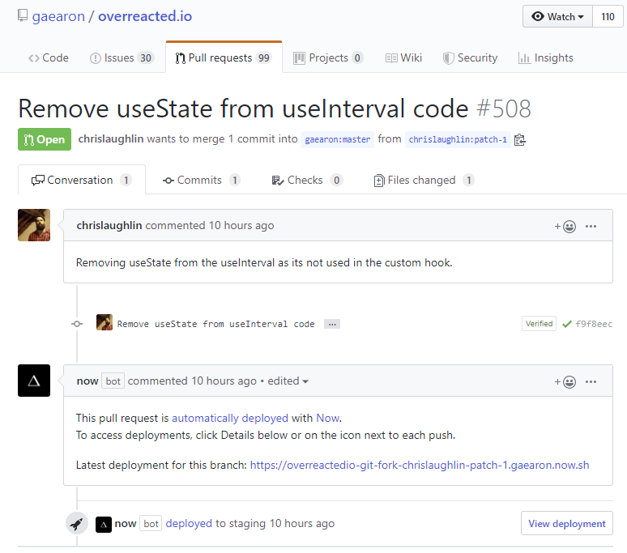

now 라는 bot이 쓴 댓글를 보면 Now가 이 풀 리퀘스트를 자동으로 배포했고, 밑에 링크로 가면 해당 브랜치의 배포판이 있다.

나도 갖고 싶어.

## 출동

[now 서비스](https://zeit.co/login)를 찾아간다.

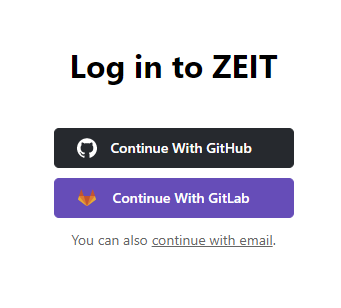

사이트 메인에 도달하니 ZEIT에 로그인 하란다. 나는 github으로 로그인 했다.

그리고 프로파일을 설정하라고 한다.

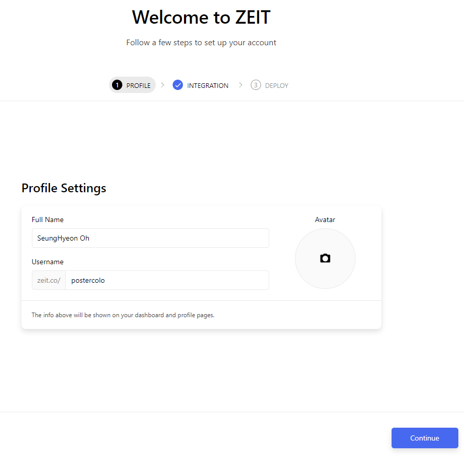

응 대충 한다.

깃헙에 Now를 세팅하라고 한다.

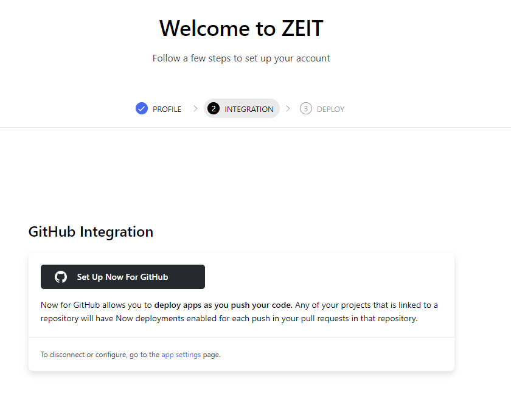

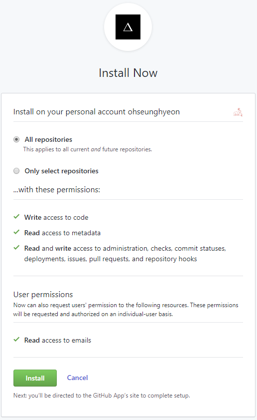

응 인스톨 한다.

나는 Only select repositories에 체크해서 `Gatsby-blog` 라는 내 정적 파일 생성기 저장소에 설치했다.

그리고 프로젝트를 만들라고 한다.

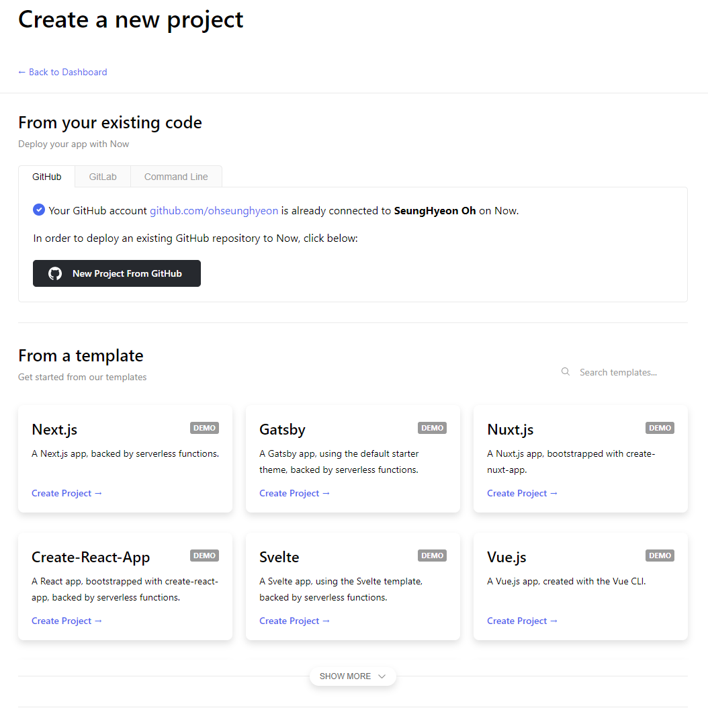

두 메뉴가 보인다.

- From your exsting code

- From a template

From a template은 저장소를 새로 만드는 것 같다.
나는 From your exsting code에서 `Gatsby-blog` 저장소를 선택했다.

그랬더니

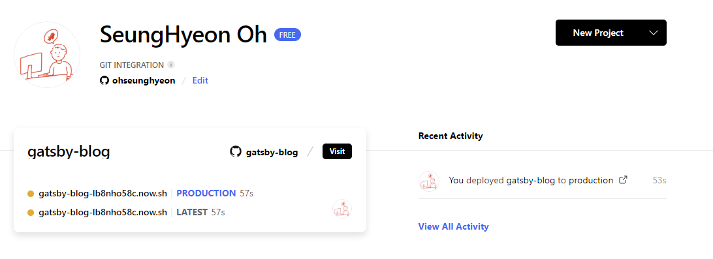

알아서 빌드를 하고 배포를 해줬다...?

저 노란 서클은 배포가 완료되면 초록색으로 바뀐다.

그리고 해당 프로젝트를 선택하게 되면 아래와 같은 화면이 나온다.

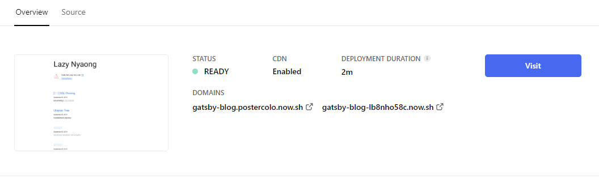

Visit을 누르거나 저 url로 이동하니 내 블로그가 나왔다.

다시 한 번 푸쉬를 했더니 자동으로 배포를 해줬다. 

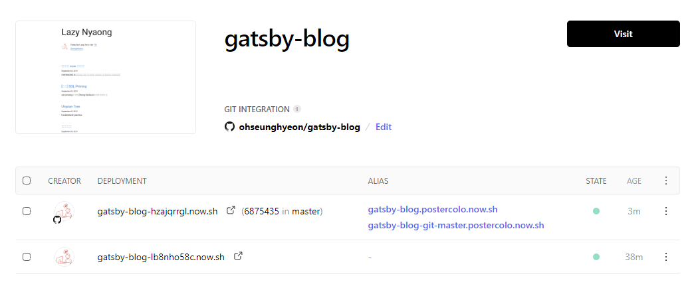

그래그래..

이제 풀 리퀘스트를 했을 때 어떻게 되는지 보고 싶어.

그래서 풀 리퀘스트를 만들어 봤다.

그랬더니 now가 배포중이라고 밑에 달린다.

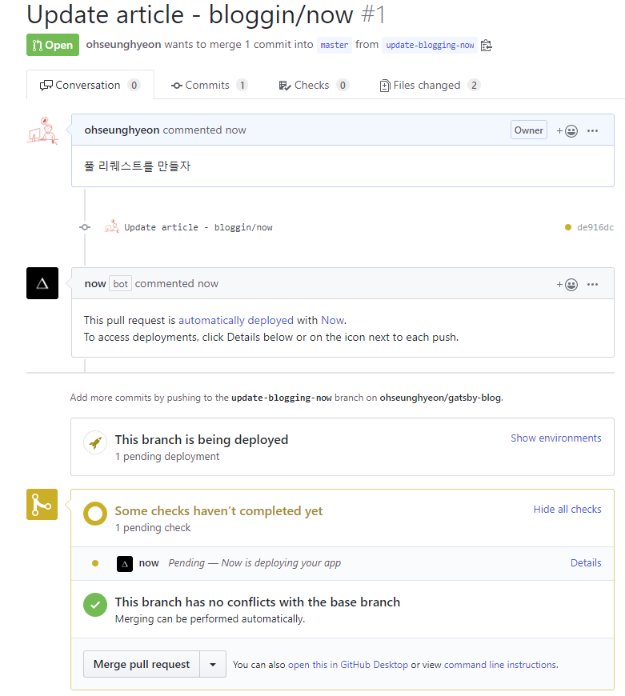

그리고 now 사이트의 `gatsby-blog project` 화면에서도 자동으로 배포중인 내역이 보인다.

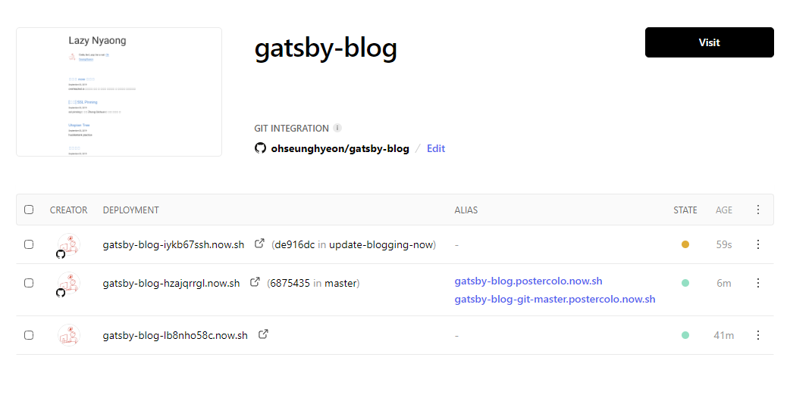

마지막으로 배포가 완료된 후 now bot이 단 댓글이 수정되며 해당 브랜치의 주소가 생성된다.

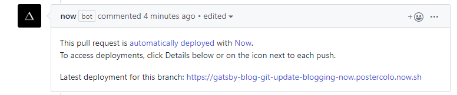

멋져

---

신기해

내가 촌놈이 된 기분이야