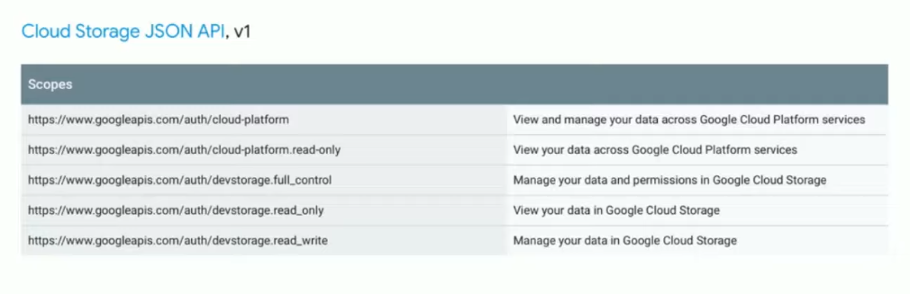

`youtube:https://www.youtube.com/watch?v=t0nl5aUfAvY`

APIs에 대하여 documentation, URLs, Payloads, Authentication, Authorization, Errors, Caching를 주제로 각각의 The good, The bad, The ugly 케이스를 얘기한다.

## Documentation

- The Good: It Exists
- The Bad: Not up to date
- The Ugly: Where is the documentation?

## URLs
- The Good: **Consistency**

if it respects REST Conventions

```
  /users/22445
  /products/3156
  /movies/127/times
```

- The Bad: Inconsistency

```
  /users/22445
  /reviews/3156  <== Not review or time id's
  /times/127
```

- The Ugly:

```
  GET /remove  <==used GET method to delete something
```

## Payloads
- The Good
  - 하나의 Endpoint에 필요한 모든 데이터가 있는 경우
  - Content-Type을 잘 지키는 경우
  - Versioning이 필요할 때 하는 경우 (그렇지 않을 경우, 어느 순간 Breaking change로 인해 payload에 변동이 있을 경우 client는 고장난다)

- The Bad
 
  - 같은 값에 대해 Endpoint마다 다른 property로 전달하는 경우

      | Endpoint | "id" field |
      | - | - |
      | /products | id |
      | /products/:id | productID |
      | /cart | product_id |

  (이런 경우는 나도 자주 봤는데, 특히 각각의 Endpoint를 개발한 사람이 다른 경우 발생하기 쉽다.)

  - Payload가 자주 변하는 경우: 이미지의 경로가 http://images~ 였는데 암묵적으로 http:// 를 빠지게 되어서 client에서 이미지가 나오지 않게 되었다.

- The Ugly
  - JSON containing HTML | XML containing HTML
  - Unstable: 

## Authentication: Who are you?
- The Good
  - SSL
  - [SSL Pinning](/study/ssl-pinning/)
  - OAuth
- The Bad
  - OAuth (she says OAuth is very controversial)
- The Ugly: 직접 다 만드는 경우

## Authorization: What are you allowed to do?
- The Good
  - App Requests Permissions
  
- The Bad: A Single Api Key => 키가 탈취당할 경우 
- The Ugly: Authorization? 만약 Authentication(인증)만 있고 그걸로 모든 권한을 준다면, 결국 어딘가 잘못될 것이다.
모바일 앱이라고 해도 Charles(Web Debugging Proxy) 같은 HTTP debugger로 해킹은 가능하다.

## Errors
- The Good
  - proper HTTP status code
  - error message in response
  - human readable error message
- The Bad
  - messages like "There was an error" => 불친절한 메시지
  - status code는 200인데, error code를 response body에 담는 경우
- The Ugly
  - HTML page를 return하는 경우
  - 404 page를 200 code와 함께 return하는 경우

## Caching
- The Good
  - Using one of the standards
  - Cache-Control
  - etags
- The Bad
  - no caching but Manually processing data
- The Ugly: cache? i don't care

# TR;DL

### What's needed in your API

- Consistency
- Conventions
- Simple

## Q&A

- api endpoint의 versioning에 대해 선호하는 방법: Path로 버전을 설정하는 걸 좋아한다. header나 date를 가지고 versioning을 할 수도 있을 것이다.

- HTTP2를 사용해도 여러개의 Api를 합쳐서 하나로 만들 필요가 있을까? (payload에서 the good에 해당하는 질문): 여러개의 api를 호출하면 그 중 하나는 실패할 수 있다. 그게 서버상의 문제일 수도 있고 인터넷 환경에 의한 경우일 수 있다.
